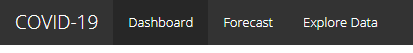
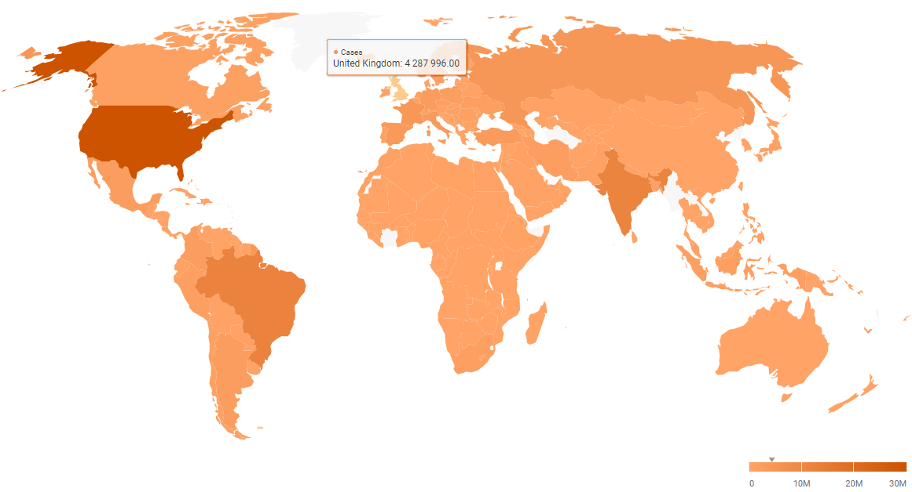
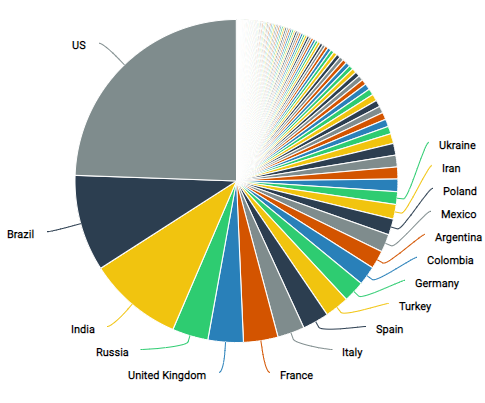
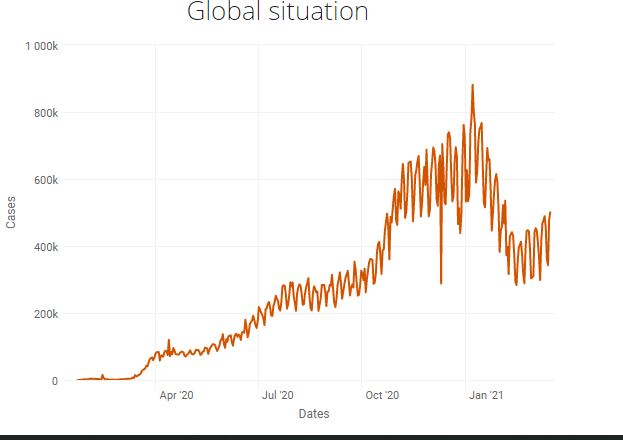
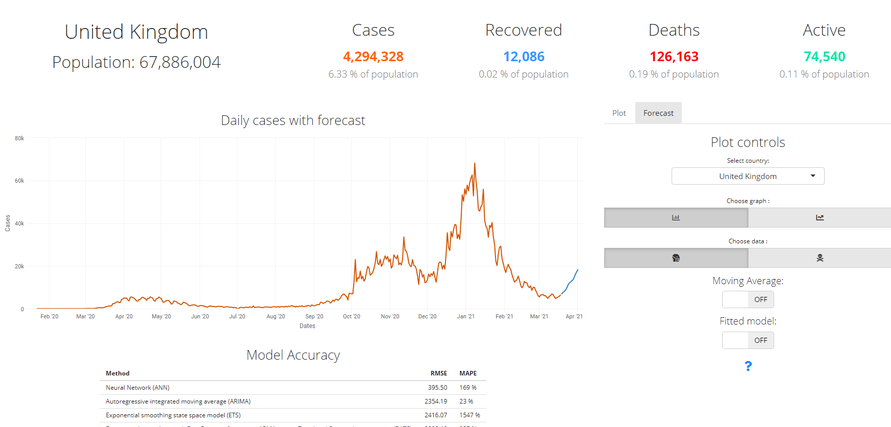
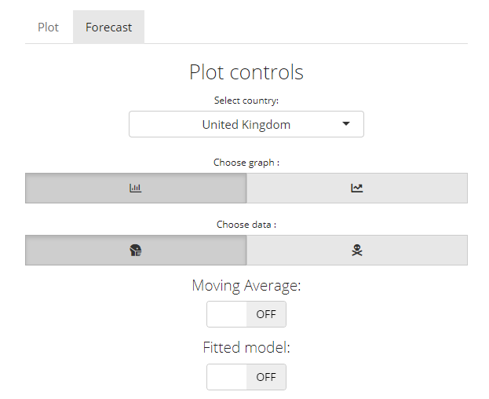
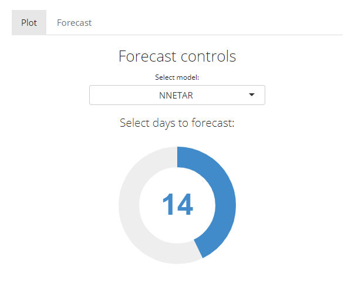

# COVID-19 Visualsation and Forecast
## Description
COVID-19 has affected millions of people and their day-to-day life. It has also affected the global economy which leads to high unemployment due to national lockdowns. This disease took around 2.5 million lives and many are still recovering which puts a great pressure on health services. This has a massive impact on people who may need medical attention for other reasons then coronavirus. Therefore, it would be essential to have some form of system that can predict number of cases from models that could indicate an upcoming outbreak of this disease and allow government, health services and public to be more prepared for outbreaks or even try to prevent them. 

## Approach
Neural networks have been very promising in predicting the number of cases based on historical data. However, there are many more methods that can be applied in similar way and can provide different results which then can be compared. Firstly, the data were gathered from a GitHub repository and processed into time series. This enables the data to be passed into the models function that trains on the data and provides residuals that were used to estimate the accuracy of forecast. This then can be plotted and produce a forecast for upcoming days. Some models will perform better on some countries then others as well as on global scale which will have impact on how accurate the forecast will be for that specific data. This could be due to many reasons. One of them could be that the data provided is inconsistent or too chaotic. This could result from not performing enough tests regularly. 

## Structure of the app: 
The applciation is dividede into three section:
* Dashbaord
* Forecast 
* Explore data 

> This stuructre is made using tabs

## Dashboard functions:
This system provides visualization of the data, for example, using time series plots to display daily number of cases, deaths, recovered and active cases around the globe.
Choropleth maps to indicate effected areas in individual countries as well as pie chart to view what part individual countries represent of global situation. 
These functionalities will help users to understand analyzed data in a clear way. 

> Map of global number of cases for individual countries

> Pie chart of global number of cases for individual countries

> Plot for daily number of cases globally
> 
## Forecast
The historical data is used to train diffrent types of models which then they can be used to predict number of cases to some level of ceretainy. 
This might me very helpful in predicting an outbreak of particular country. Of course these models will perform difrent, therefore they need to be messured and comapred for optimal performance.
The accuracy is measured using root mean square error which shows on average, how many values the forecast was away from actual.
It's also messured using mean absolute percetange error which shows ... 
This varies between country but it gives an idea of how accurate the forecast can be.

> The forecast page

The plot can be modified using controls provided which are divided for plot and forecast: 

>Plot controls:

> Forecast controls:

