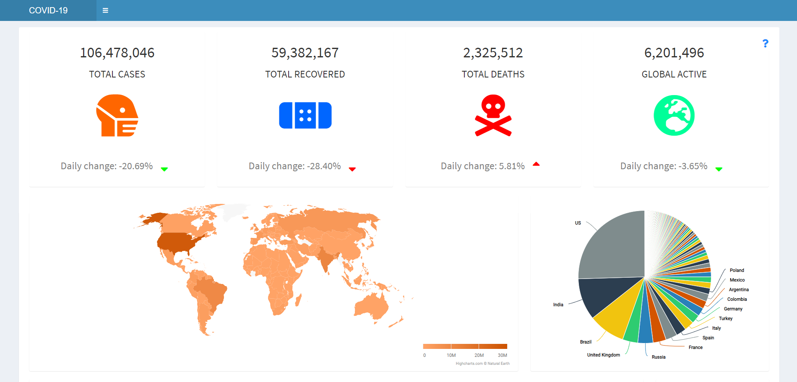
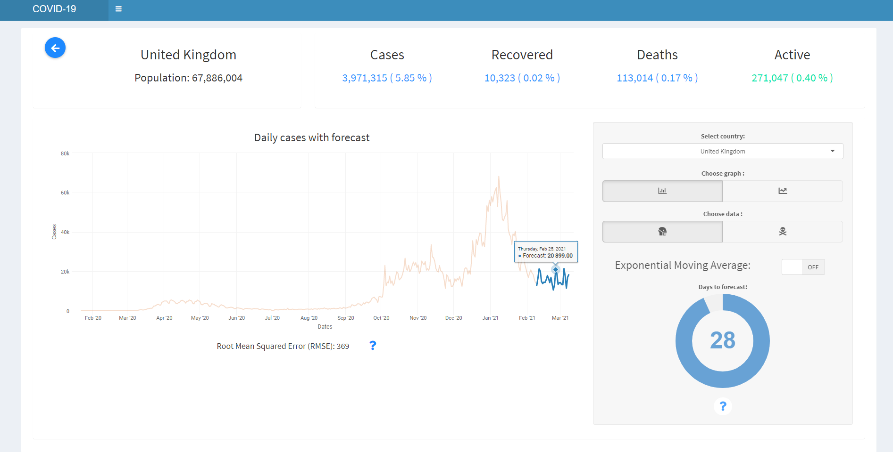

# COVID-19 Forescasting-system 

> Dashboard of the system representing situation
## Description
This is a system that enables users to view current global situation of COVID 19.
It main functionality is to forecast cases for individual countries.

This system provides visualization of the data, for example, using time series plots,
choropleth maps to indicate effected areas. These will help users to understand analyzed
data in a clear way. Moreover, the historical data is used to predict future events and to 
build models that highlight important trends.
Furthermore, these models are used on train data which will try to predict future cases or deaths.
This might me very helpful in predicting an outbreak of particular country.

## Forecast

> The forecast is using forward-feed neural network algorithm.

The accuracy is measured using root mean square error which shows on average, how many values the forecast was away from actual.
This varies between country but it gives an idea of how accurate the forecast can be. 
