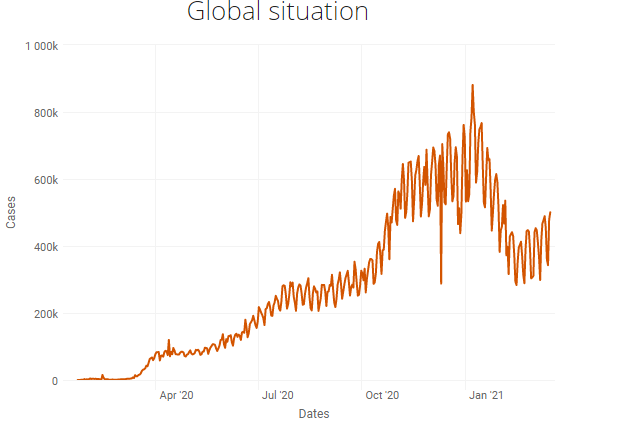

# COVID-19 Visualsation and Forecast
## Description
This is a system that enables users to view current global situation of COVID 19 which is represneted using:

## Dashboard functions:
* Map

* Pie chart

* Daily and Cumulative plot.

This system provides visualization of the data, for example, using time series plots to display daily number of cases, deaths, recovered and active cases around the globe.
Choropleth maps to indicate effected areas in individual countries as well as pie chart to view what part individual countries represent of global situation. 
These functionalities will help users to understand analyzed data in a clear way. 

> Dashboard of the system Visualizing global situation.

## Forecast
The historical data is used to train diffrent types of models which then they can be used to predict number of cases to some level of ceretainy. 
This might me very helpful in predicting an outbreak of particular country. Of course these models will perform difrent, therefore they need to be messured and comapred for optimal performance.
The accuracy is measured using root mean square error which shows on average, how many values the forecast was away from actual.
It's also messured using mean absolute percetange error which shows ... 
This varies between country but it gives an idea of how accurate the forecast can be.

> The forecast page

